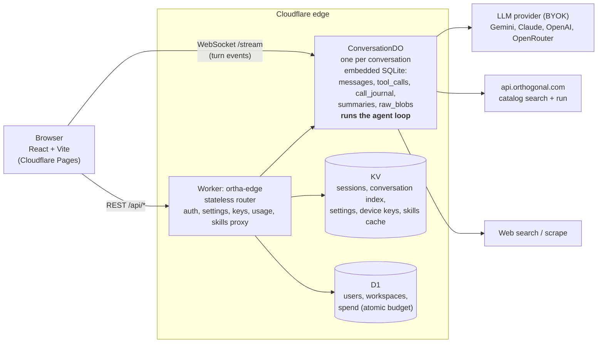

# Ortha

**An AI chat app that finds and calls the right API at runtime.** Ask a question in plain English; Ortha searches Orthogonal's API catalog (company data, contacts, people search, enrichment, social, funding, news), calls the endpoint that fits, and answers with real data. It also has web search and scraping for open-web questions.

**Live app:** https://ortha-web.pages.dev

Ortha runs entirely on Cloudflare: a stateless Worker, one Durable Object with its own SQLite database per conversation, KV and D1. The agent loop, context management and API harness are TypeScript packages in a Bun monorepo with 370+ unit tests.

> Bring your own keys: add a model key (Gemini, Anthropic, OpenAI or OpenRouter) and an Orthogonal key in **Settings**. Keys are encrypted and stored per device, never synced. Chats and settings sync across your devices.

---

## Highlights

| Problem | How Ortha handles it |
|---|---|
| **Big API responses and long chats fill the context window** | Tool results are **distilled** into a compact summary for the model while the full payload is stored out of context and pulled back only on demand (`expand_result`). History is windowed and older turns fold into a **rolling summary**. See [Context-window management](#context-window-management). |
| **Conversations must survive leaving and coming back** | Each conversation is a **Durable Object with its own SQLite**. Reopening rehydrates the transcript and rebuilds the agent trace (price, latency, "Open raw"), synced across devices by account. See [Persistence](#persistence). |
| **Scale** | Stateless Worker router, **one Durable Object per conversation**, KV for sessions, settings and keys, D1 for accounts and spend. Load spreads horizontally by conversation. See [System design](#system-design). |
| **Many users hitting the same APIs** | Every conversation is an isolated DO, spend is enforced **atomically per workspace** in the database, and within a turn identical calls are **coalesced** and a failing provider trips a **circuit breaker**. See [Concurrency](#concurrency-many-users-hitting-the-same-apis). |
| **An API is slow or down** | A call times out at 30s, the failure shows in the trace and is fed back to the model, and the agent tries another endpoint or answers with what it has. The chat never hangs. See [When an API is slow or down](#when-an-api-is-slow-or-down). |

---

## What it does

- **Runtime API discovery.** No hard-wired integrations. The model gets four meta-tools and finds everything at runtime: `search_tools` finds an endpoint in Orthogonal's catalog, `get_tool_details` inspects its schema, price and side effects, `run_tool` executes it through a budgeted harness, and `expand_result` pulls a full payload back on demand. `web_search` and `web_scrape` are always available and free.
- **Context-frugal tool calls.** One API response can be hundreds of KB, far too big for the model's context. `run_tool` distills each result into a compact summary that goes into context, and stores the full raw payload in the conversation's Durable Object under a `requestId`. The model reasons from the summary and calls `expand_result(requestId)` only when it needs more. Web scrapes work the same way. This is also why the trace's "Open raw" button can fetch the complete payload long after the turn ended.
- **Real results.** Prompts like "Enrich stripe.com with funding and team size", "Find VPs of Sales at Stripe" or "What raised a Series A in fintech this month?" route to the right catalog endpoint (Apollo, Fiber, Fundable, PredictLeads, Crustdata, ScrapeCreators and others) and come back as grounded data.
- **Any model provider.** Gemini 3 Flash (default) and Gemini 3 Pro, plus Anthropic, OpenAI and OpenRouter adapters, switchable in Settings.
- **Skills.** Save reusable prompt workflows, or browse public skills pulled live from `orthogonal.com/skills`, add one in a click and run it with `/<skill>`. A skill runs inline in the same agent loop, so its tool results are distilled like any other turn's.
- **Parallel agent runs.** Every turn is a separate run in the **Agents panel**. **Batch** fans one prompt across many inputs (for example, enrich 50 domains), each as its own run with its own trace, so a bulk job never blocks the main chat.
- **Transparent and safe.** Every tool call streams to a live trace. Expensive calls and any write or side effect (such as sending an email) pause for explicit approval. Per-conversation and monthly **spend caps** are enforced in the database.
- **Rich rendering.** Answers stream token by token as GitHub-flavored markdown with tables, highlighted code and LaTeX.
- **Accounts.** Email and password or Google sign-in.

---

## Architecture



**The agent loop** (`packages/agent`) is an async generator that yields trace events (`token`, `tool_call_started`, `tool_result`, `permission_required`, `cost_update`, `done`) streamed over the WebSocket. On each step the model either answers or requests a tool. The harness executes the tool (budget-checked and idempotent), distills the result back into context, and the loop continues until the answer is complete.

**Monorepo** (Bun workspaces, TypeScript):

| Package | Responsibility |
|---|---|
| `contracts` | Frozen interfaces every module builds against, plus in-memory mocks. |
| `agent` | The agent loop and the tool and prompt definitions. |
| `harness` | Orthogonal API client (timeout, retry, circuit breaker), web search and scrape client, result distillation. |
| `llm` | Provider adapters (native Anthropic plus one OpenAI-compatible adapter for Gemini, OpenAI and OpenRouter) and the model catalog. |
| `context` | Prompt-window assembly under a token budget, rolling conversation summary, retrieval, token estimation. |
| `budget` | Reservation policy: reserve, run, then settle or refund. |
| `auth` | PBKDF2 password hashing, session tokens, Google OAuth exchange. |
| `db` | D1 and SQLite stores for the transcript (messages plus tool metadata) and the atomic spend logic (`tryReserveSpend`). |
| `apps/edge` | The Worker, the `ConversationDO` and all routes. |
| `apps/web` | The React UI. |

---

## System design

### Databases and why

| Store | Used for | Why |
|---|---|---|
| **Durable Object + SQLite** (one per conversation) | Full transcript: messages, tool calls with their requestIds, the idempotency journal, rolling summaries, and raw tool payloads kept out of context. | A conversation is a natural single-writer unit. Keeping its state next to the compute that runs the turn removes cross-request contention and gives serialized, strongly consistent reads and writes with no distributed locking. |
| **KV** | Sessions (`session:<token>`), per-workspace conversation index, workspace settings, device-scoped BYOK keys, public-skills cache. | Cheap, globally replicated, read-heavy lookups, one fast read per request. Keys are read with strongly consistent `get`, not `list`. |
| **D1** (SQLite) | Accounts (users, workspaces, memberships) and spend (monthly reserved and settled against a cap). | Needs aggregation across conversations and a transactional guarantee against overspend, which a relational store gives cleanly. |

### How it scales

- **Horizontal by conversation.** Each conversation is its own Durable Object, so load spreads across many independent DOs with no shared hot path between unrelated conversations. The Worker layer is stateless and auto-scales.
- **Edge-cached reads.** Sessions, settings and the public-skills catalog are KV reads near the user. The skills catalog is cached for an hour so Orthogonal isn't hit on every request.
- **Spend is the one global invariant**, and the database enforces it, so it stays correct as users grow.
- **The bottlenecks are upstream**, in the LLM and Orthogonal APIs. That is why the harness has timeouts, retries and a circuit breaker, and why budget caps are hard limits.

### Context-window management

Two pressures, large API responses and long history, handled in four layers:

1. **Tool results are distilled.** `run_tool` puts a compact summary and a `requestId` into the model's context. The full raw payload goes to the DO (`raw_blobs`) and comes back only through `expand_result(requestId)`. A 900 KB enrichment response never floods the window, and the complete data is still one call away.
2. **History is windowed.** `loadWindow` assembles the most recent messages that fit a token budget (`HISTORY_BUDGET_TOKENS = 8000`, estimating tokens as chars/4), oldest first, and never starts on a tool result whose parent call was trimmed.
3. **Rolling summary.** Turns that age out of the window fold into a running summary injected as a system note, so multi-hour conversations stay bounded.
4. **Images stay out of the transcript.** Vision attachments go to the model on the turn that needs them but are not written to the message store, so they don't bloat the window or storage on every reload.

The per-call output ceiling is 8192 tokens. Thinking models like Gemini 3 spend output tokens on hidden reasoning before the answer, and a smaller ceiling cut research answers off mid-sentence.

### Persistence

Conversations live in their Durable Object's SQLite, keyed by conversation id and reachable from any device. On reconnect the transcript is rehydrated, including tool-call messages and their requestIds, so a cross-turn `expand_result` still works after you leave and return. Reopening a conversation also rebuilds its agent-trace blocks from the stored transcript: the collapsible `run_tool` and web steps come back with API, path, status, price, latency and a working "Open raw". Accounts (email and password, or Google) anchor identity. Chats and settings sync per workspace, while BYOK keys stay on the device. A cheap model writes conversation titles so the sidebar stays readable.

### Concurrency: many users hitting the same APIs

Concurrent users never contend inside Ortha and can't overspend or corrupt each other's data. Within a turn, repeated calls to the same endpoint are collapsed and a failing provider fails fast.

- **Isolated by conversation.** Unrelated users and conversations run fully in parallel with no shared in-process state and no global lock or queue in the hot path. Within one conversation, turns are serialized, one in flight per DO, so there is no race there either.
- **No overspend, enforced by the database.** Each tool call reserves budget with an atomic conditional `UPDATE` (`reserved + settled + new <= cap` in the `WHERE`). An over-cap reservation changes zero rows and is refused, so one user's burst can't exceed another's cap. Reserve, run, then settle or refund releases a high estimate back.
- **Dedupe and circuit breaker within a turn.** The Orthogonal client keeps an in-flight dedupe cache, so identical concurrent `{api, path, body, query}` calls become one upstream request. A per-provider circuit breaker opens after 5 consecutive failures, cools down for 30s, then sends a half-open probe.
- **Current scope.** The dedupe cache and breaker live in the per-turn client, so today they protect within a turn. A shared cross-user cache, rate limiter and breaker (in KV or a coordinator DO) is the next step; see [Next steps](#next-steps).

### When an API is slow or down

The chat stays responsive and always resolves. A slow call is abandoned at 30s, a failed call shows up as a failed step in the live trace, and the agent keeps going with another endpoint or with what it already gathered.

- **Hard 30s timeout** per Orthogonal call (`AbortController`), matching the Worker fetch budget.
- **Retry with backoff** for retryable reads. **Writes are never retried**, because an ambiguous timeout on a paid write must not double-charge.
- **Per-provider circuit breaker** stops the agent from hammering a known-bad endpoint.
- **A failed tool never aborts the turn.** The error goes back to the model as the tool result, so it corrects course instead of ending on an error.
- **Web tools degrade gracefully.** Each scrape has a ~10s wall-clock cap, known bot-walled hosts (LinkedIn and similar) short-circuit instantly, multi-page reads run up to 4 in parallel, and rate-limit or blocked results are non-fatal.
- **Long-running submit-then-poll endpoints** (crawls, async deep research) that can't finish in 30s are refused up front instead of charged and aborted, and the agent picks a synchronous alternative.
- **Cost and side-effect gates** stream inline. Declining cancels cleanly with nothing sent.

---

## Tech stack

- **Runtime:** Cloudflare Workers, Durable Objects (SQLite storage), KV, D1, Cloudflare Pages
- **Language and tooling:** TypeScript, Bun workspaces, Vitest, Wrangler
- **Frontend:** React 18, Vite, react-markdown with remark-gfm, remark-math, rehype-katex and rehype-highlight
- **Validation:** Zod
- **Models:** Gemini, Anthropic, OpenAI and OpenRouter through provider adapters (bring your own key)
- **Data APIs:** Orthogonal API catalog, plus web search and scraping

---

## Run it locally

Requires [Bun](https://bun.sh) and Node 22+.

```bash
bun install

# typecheck and tests
bun run typecheck
bun run test

# web (Vite dev server on http://localhost:5173)
bun --cwd apps/web run dev

# worker (local, with Durable Objects, D1 and KV emulation)
bun --cwd apps/edge run dev
```

The web app points at the deployed worker by default (`VITE_ORTHA_API`). To use a local worker, set `VITE_ORTHA_API=http://127.0.0.1:8787` for the web app.

**Deploy:** `wrangler deploy` from `apps/edge` (worker), then `bun run build` and `wrangler pages deploy dist --project-name ortha-web` from `apps/web`. The worker needs the `KV`, `DB` (D1) and `CONVERSATION_DO` bindings from `apps/edge/wrangler.toml`, plus secrets set with `wrangler secret put`: `KEY_ENCRYPTION_KEY`, and optionally `JINA_API_KEY` and `GOOGLE_CLIENT_SECRET` for Google sign-in. Model and Orthogonal keys are entered in the UI, so no API keys are baked into the deploy.

---

## Testing

`bun run test` runs the unit suite: contract mocks, the agent loop, provider adapters, budget and idempotency, context windowing, auth, and the skills and title helpers. The deployed app has also been exercised end to end over its real WebSocket against live Orthogonal and model APIs: auth, conversation persistence, tool execution, the cost and side-effect gates, installing and running a skill, and concurrent multi-conversation load.

---

## Next steps

- **Deterministic tool selection.** The same prompt can occasionally route to different catalog endpoints. Ranking and pinning endpoints per intent, and caching the chosen endpoint per conversation, would make results reproducible and costs predictable.
- **Fleet-wide upstream protection.** A shared cross-user response cache, rate limiter and circuit breaker (in KV or a coordinator DO), so identical calls from different users coalesce and one hot or failing endpoint is throttled globally.
- **Connectors.** The Connectors screen has a Gmail card scaffold. Finishing OAuth would give the agent a Gmail tool behind the existing side-effect gate.
- **Provider-error sanitization and auto-continue** on `max_tokens`, so a truncated answer continues instead of relying on a generous ceiling.
- **Semantic retrieval over history** with embeddings instead of a pure recency window.
- **Observability:** per-turn metrics (tool latency, cost, truncation rate) and dashboards.
- **Eval harness** for the agent loop with golden conversations for routing, grounding and recency.
